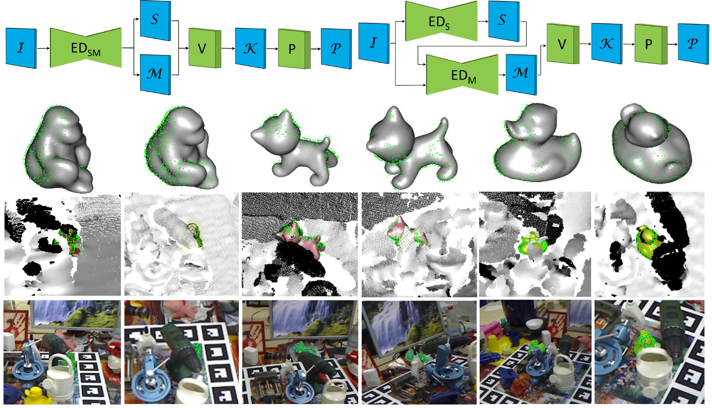

# RCVPose 3D


(3DV Poster) [Keypoint Cascade Voting for Point Cloud Based 6DoF Pose Estimation](), a pure point cloud solution for 6DoF pose estimation.
## Initalization
### Dependencies
### Dataset
Download LINEMOD, OCCLUSION_LINEMOD and YCB-Video from [BOP](https://bop.felk.cvut.cz/datasets/), follow the [BOP toolkit}(https://github.com/thodan/bop_toolkit.git) to set up the datasets and then run 
```
python gt_bop.py --root $(DATASET_ROOT)$
```
to generate the point cloud and radii for training and validation.
The pre-generated point cloud and GT Radii can be downloaded here [here](https://queensuca-my.sharepoint.com/:f:/g/personal/16yw113_queensu_ca/EvettGjIvpdArIyvUI8pnx4BYqtTjZl-RLa_6ah3N_jD4A?e=Hg4sfW).

Note that the minmax values are required for standrization when training the model in this step.

## Train
The semantic segmentation and radii regression are trained saperately. This means that both of the networks can be trained simultaneously. In order to train the segmentation part, simply run
```
python main.py --root_dataset $(DATASET_ROOT)$ --globalmin 0 --globalmax 1 --obj_idx 1

```
## Test
Pending...
## Citation
Please cite us if our work is helpful:
```
@inproceedings{wu2022keypoint,
      title = {Keypoint Cascade Voting for Point Cloud Based 6DoF Pose Estimation},
      author = {Wu, Yangzheng and Javaheri, Alireza and Zand, Mohsen and Greenspan, Michael},
      booktitle = {2022 International Conference on 3D Vision (3DV)},
      year = {2022},
      organization={IEEE}
  }
```
## Acknowledgements
This work is supported by Bluewrist Inc. and NESERC.
